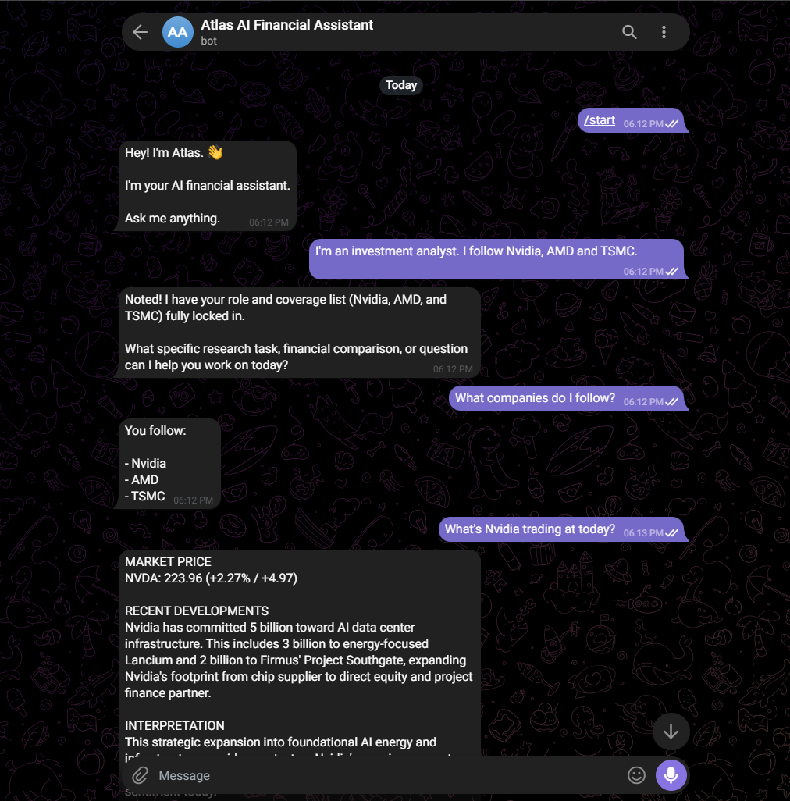
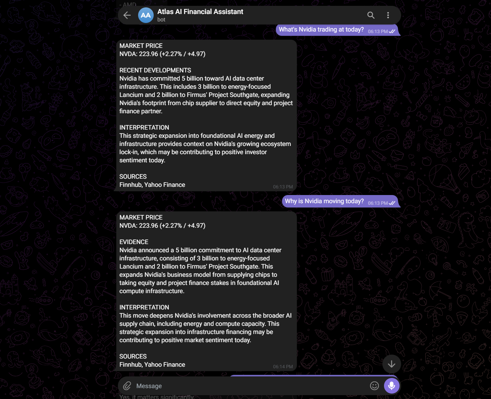
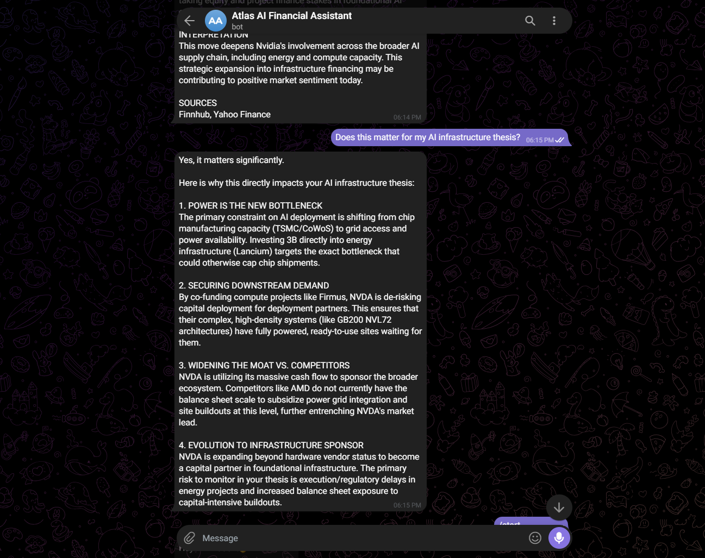

# Atlas AI — Personalized Financial Research Assistant

Atlas AI is an AI-powered financial research assistant built for investment analysts.

Unlike a generic financial chatbot, Atlas remembers the analyst's role, watchlist, and investment interests, combines that context with live financial data and relevant company news, and uses evidence-grounded AI reasoning to explain market movements and connect them to the analyst's investment thesis.

---

## 🚀 What Makes Atlas Different?

Financial analysts repeatedly perform the same workflow:

1. Check what companies they cover.
2. Look up current prices.
3. Search for relevant news.
4. Determine why a stock is moving.
5. Compare the development against their investment thesis.
6. Repeat the process every day.

Atlas brings this workflow into a single personalized assistant.

### Example

An analyst tells Atlas:

> "I'm an investment analyst. I follow Nvidia, AMD and TSMC, and I'm interested in AI infrastructure."

Later, the analyst can simply ask:

> "Why is Nvidia moving today?"

And then:

> "Does this matter for my AI infrastructure thesis?"

Atlas already knows the analyst's context and can use current market evidence to answer.

---

# ✨ Key Features

## 🧠 Persistent Analyst Memory

Atlas stores useful long-term user context such as:

- Professional role
- Companies followed
- Investment interests
- Relevant preferences

Example:

```text
Role: Investment Analyst

Coverage:
• Nvidia
• AMD
• TSMC

Interest:
• AI Infrastructure
```

Memory is stored in SQLite and persists across application restarts.

## 📈 Live Market Data

Atlas retrieves current market information using Finnhub.

Example:

```text
NVIDIA (NVDA)

Price: $223.14
Previous Close: $223.96
Change: -0.37%
```

The system distinguishes live financial facts from AI-generated interpretation.

## 📰 Company News Research

Atlas retrieves recent company news and processes the results before presenting them to the AI.

The news pipeline includes:

- Company-specific news retrieval
- Date-window filtering
- Relevance scoring
- Ranking
- Noise removal
- Evidence formatting

This prevents unrelated articles from unnecessarily entering the AI reasoning context.

## 🔎 "Why Is This Stock Moving?"

Atlas can analyze questions such as:

> "Why is Nvidia moving today?"

The workflow combines:

Live Market Data
       ↓
Recent Company News
       ↓
Relevance Filtering
       ↓
Evidence Ranking
       ↓
Causal Confidence
       ↓
Gemini Reasoning
       ↓
Financial Explanation

Atlas does not automatically assume that a news article caused a price movement.

Instead, it distinguishes between:

- Verified facts
- Reasonable interpretations
- External knowledge
- Speculation

This helps prevent unsupported causal claims.

## 💡 Personalized Investment Thesis Reasoning

Atlas can connect new information to the analyst's previously saved interests.

Example:

> "Does this matter for my AI infrastructure thesis?"

Instead of requiring the analyst to repeat their thesis, Atlas uses the saved context.

This enables a more natural research workflow.

## 🌅 Personalized Morning Briefing

Atlas can generate a personalized morning briefing based on the user's saved coverage list.

The briefing:

- Checks tracked companies
- Reviews relevant market developments
- Filters insignificant information
- Surfaces only important developments
- Explains why an item may matter

The system follows a silence-by-default philosophy — insignificant developments should not create unnecessary alerts.

## 🛡️ Financial AI Safety

Financial reasoning requires more caution than ordinary conversational AI.

Atlas is explicitly designed to avoid:

- Fabricating market explanations
- Presenting speculation as fact
- Claiming correlation proves causation
- Inventing financial data
- Giving unsupported certainty
- Using stale AI knowledge as current market data

When evidence is insufficient, Atlas is instructed to say so.

## 🚦 Graceful AI Rate-Limit Handling

Atlas remains useful even when the Gemini API is temporarily unavailable.

For example, if Gemini is rate-limited:

```text
Atlas AI interpretation is temporarily unavailable
due to rate limits.

Here is the verified live market data...
```

The system does not fabricate an explanation just because the reasoning model is unavailable.

Memory operations are also independent of Gemini availability, allowing structured user information to continue being saved and retrieved.

# 🏗️ Architecture

```text
                    ┌──────────────────┐
                    │     Telegram     │
                    │      User        │
                    └────────┬─────────┘
                             │
                             ▼
                    ┌──────────────────┐
                    │     FastAPI      │
                    │   Application    │
                    └────────┬─────────┘
                             │
                             ▼
                    ┌──────────────────┐
                    │ Intent Detection │
                    └───────┬──────────┘
                            │
              ┌─────────────┼─────────────┐
              │             │             │
              ▼             ▼             ▼
        ┌──────────┐  ┌───────────┐  ┌───────────┐
        │  Memory  │  │ Financial │  │ Conversa- │
        │  System  │  │ Research  │  │   tion    │
        └────┬─────┘  └─────┬─────┘  └───────────┘
             │              │
             ▼              ▼
        ┌──────────┐   ┌──────────────┐
        │  SQLite  │   │ Finnhub API  │
        └──────────┘   └──────┬───────┘
                              │
                              ▼
                       ┌──────────────┐
                       │ News Filter  │
                       │ & Ranking    │
                       └──────┬───────┘
                              │
                              ▼
                       ┌──────────────┐
                       │   Evidence   │
                       │   Pipeline   │
                       └──────┬───────┘
                              │
                              ▼
                       ┌──────────────┐
                       │    Gemini    │
                       │ AI Reasoning │
                       └──────┬───────┘
                              │
                              ▼
                       ┌──────────────┐
                       │ Atlas Answer │
                       └──────────────┘
```

# 🧩 Technology Stack

| Component | Technology |
| --- | --- |
| Language | Python |
| Backend | FastAPI |
| Messaging | Telegram Bot API |
| AI | Google Gemini |
| Market Data | Finnhub |
| Financial Data Fallback | Massive |
| Regulatory Data | SEC EDGAR |
| Database | SQLite |
| HTTP Client | HTTPX |
| Testing | Pytest |
| Configuration | python-dotenv |
| Async Runtime | asyncio |

# 📁 Project Structure

```text
atlas-ai/
│
├── app/
│   ├── ai/
│   │   ├── agent.py
│   │   └── prompts.py
│   │
│   ├── database/
│   │   └── memory.py
│   │
│   ├── finance/
│   │   ├── market_data.py
│   │   ├── metadata.py
│   │   ├── news.py
│   │   ├── research.py
│   │   └── sec.py
│   │
│   └── main.py
│
├── tests/
│   ├── conftest.py
│   ├── test_market_data.py
│   ├── test_market_movement.py
│   ├── test_morning_briefing.py
│   ├── test_news_client.py
│   ├── test_research_company.py
│   ├── test_sec_client.py
│   └── ...
│
├── .env.example
├── .gitignore
├── requirements.txt
├── verify_demo.py
├── verify_research.py
└── verify_slice.py
```

# ⚙️ Installation

1. Clone the repository
```bash
git clone https://github.com/Ishagupta145/Atlas-AI-Financial-Assistant.git
cd Atlas-AI-Financial-Assistant
```

2. Create a virtual environment

Windows
```bash
python -m venv .venv
.venv\Scripts\activate
```

macOS / Linux
```bash
python3 -m venv .venv
source .venv/bin/activate
```

3. Install dependencies
```bash
pip install -r requirements.txt
```

# 🔐 Environment Configuration

Create a `.env` file based on `.env.example`.

```ini
FINNHUB_API_KEY=
FINNHUB_BASE=https://finnhub.io/api/v1

MASSIVE_API_KEY=
MASSIVE_BASE_URL=https://api.massive.com

GEMINI_API_KEY=

TELEGRAM_BOT_TOKEN=

SEC_USER_AGENT=
```

The repository includes `.env.example` for configuration reference.

# ▶️ Running Atlas

Start the FastAPI application:

```bash
python -m uvicorn app.main:app --reload
```

Atlas can then communicate through the configured Telegram bot.

# 🧪 Testing

The project contains a comprehensive automated test suite covering:

- Memory extraction
- Memory persistence
- Memory retrieval
- Rate-limit handling
- Market-data normalization
- Finnhub integration
- News normalization
- News relevance filtering
- Market movement analysis
- SEC integration
- Financial reasoning safeguards
- Intent detection
- Morning briefing
- UX fallbacks

Run:

```bash
python -m pytest -q
```

Final verification:
- 71 passed
- 0 failed

The application import was also verified successfully:

```text
APP_IMPORT_OK
```

Tests use mocked external HTTP calls where appropriate and do not depend on live APIs.

# 🎬 Example Conversation

### Personalization

**User**
> I'm an investment analyst. I follow Nvidia, AMD and TSMC, and I'm interested in AI infrastructure.

**Atlas**
> Got it — I've saved your role, coverage list, and interest.

### Memory

**User**
> What companies do I follow?

**Atlas**
> You currently follow:
> • Nvidia
> • AMD
> • TSMC



### Live Market Data

**User**
> What's Nvidia trading at today?

**Atlas**
> NVIDIA (NVDA)
> $223.14 — down 0.37% today

### Market Research

**User**
> Why is Nvidia moving today?

**Atlas**
> Atlas combines:
> Live NVDA price movement + Recent relevant company news + Relevance scores + Evidence confidence + AI interpretation



### Personalized Reasoning

**User**
> Does this matter for my AI infrastructure thesis?

**Atlas**
> Atlas uses the previously stored analyst context to connect the current development to the user's investment thesis.



# 🧠 Design Principles

- **Evidence before explanation:** Current market information comes from external financial data providers rather than the language model's memory.
- **Personalization without repetition:** Useful analyst context is persisted so users don't need to repeatedly explain their role and coverage.
- **Conservative financial reasoning:** Atlas avoids presenting uncertain relationships as established causal facts.
- **Graceful degradation:** If an external service or AI provider becomes unavailable, Atlas falls back to whatever verified information remains available.
- **Deterministic where possible:** Memory retrieval, structured extraction, intent classification, and relevance filtering use deterministic logic where appropriate rather than depending entirely on an LLM.

# 🔮 Future Improvements

Potential production enhancements include:

- Redis-based distributed caching
- Production-grade task scheduling
- Webhook-based Telegram deployment
- Distributed worker architecture
- More advanced semantic news relevance ranking
- Additional financial data providers
- Portfolio-level analytics
- Earnings and valuation analysis
- SEC filing summarization
- Analyst-specific research workspaces
- Historical market-event analysis

# ⚠️ Current Limitations

Atlas is currently designed as a hackathon/MVP system.

Known limitations include:

- News relevance filtering is deterministic and may miss highly contextual aliases.
- Gemini availability and rate limits depend on the configured API account.
- The lightweight scheduler is designed for a single-instance MVP rather than distributed production deployment.
- Market data availability depends on the configured provider and account permissions.

# 🏆 Why Atlas?

Most AI financial assistants answer questions.

Atlas remembers the analyst.

It combines:

```text
WHO YOU ARE
     +
WHAT YOU FOLLOW
     +
WHAT YOU CARE ABOUT
     +
WHAT THE MARKET IS DOING
     +
WHAT THE NEWS SAYS
     +
WHAT THE EVIDENCE SUPPORTS
     ↓
PERSONALIZED FINANCIAL RESEARCH
```

The goal is not to replace an investment analyst.

The goal is to give the analyst a persistent, evidence-aware research companion.

# 📄 License

Developed as a hackathon MVP.
